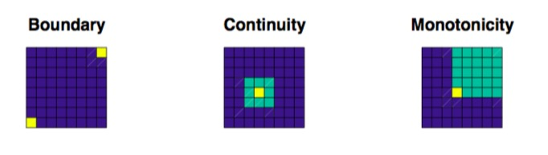

## Time Series

A time series is a sequence of measurements of a quantity (e.g. temperature, pressure) over time.

Distance/Similarity measure `d(x,y)` between the time series x and y:

- Euclidean distance
- Dynamic Time Warping
- Longest Common Subsequence model
- Threshold based distance measures

## Dynamic Time Warping

First proposed by Berndt and Clifford (1994).  

Start by constructing n × m matrix **D**, where `Di,j  = d(xi,yj)` and `d(xi,yi) = |xi −yi|`.  

#### Warping Path

A warping path w is a contiguous set of matrix elements which defines a mapping between x and y that satisfies the following conditions:

- Boundary conditions: w1 = (1, 1) and wk = (m, n) where k is the length of the warping path.
- Continuity: if wi =(a,b) then wi−1 =(a′,b′) where a − a′  ≤ 1 and b − b′ ≤ 1.
- Monotonicity: if wi =(a,b) then wi−1 =(a′,b′) where a − a′  ≥ 0 and b − b′ ≥ 0.


#### How does it work?


- Indexing - Given time series x, find time series y in database DB such that d(x,y) is minimal.
- Clustering - Split database DB into groups using d(·,·). - Classification - Given clusters DB1, · · · , DBk , which cluster does time series x belong to?
- Query search - Given large time series x and small query time series q and distance d, find subsequences of x which are less than d away from q.

#### How to speed it up?

- Global Constraints 
- Lower bounds 
- FAST DTW